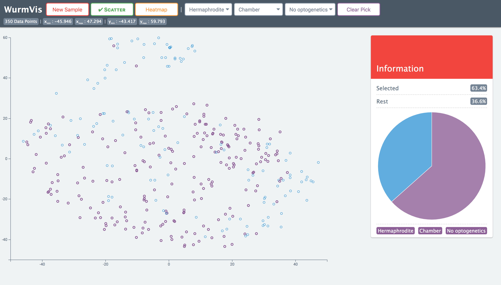

# WurmVis

> Exploring novel ways to display complex data with D3

## Features

### Scatter plot

- Each point displays multiple attributes that can be finalized further
- Clear and smooth animation that helps to relate to the data better
- Select groups of data points from the toolbar

### Heatmap

- Choose from displaying the entire dataset or a sample of it
- Easily change visualization colors from the toolbar

## Setup

#### Navigate to `vars.js` file in `js` folder
- Set your data file path in `DATA_PATH`
- Set your sample size in `SAMPLE_SIZE`
- Toggle whether heatmap displays the sampled version with `IS_SAMPLING_HEATMAP`

## Demo

Try it [here]()! *(future website)*

## Screenshots

### Explore datasets with ease and context

### Group data with similar attributes
